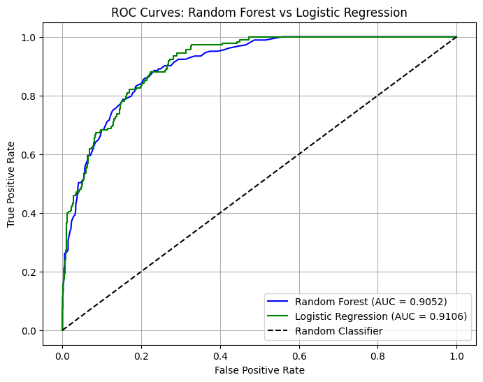

# Predicting Income Groups Based on Personal Data: Machine Learning Approach

This project focuses on predicting income levels (<=50K or >50K) using a combination of numerical and categorical data. The dataset consists of 5000 data points, where 3500 are used for training, 750 for validation, and 750 for testing.

## Overview

The goal of this project is to develop a binary classification model that can predict whether an individual's income exceeds $50K based on features such as age, education, occupation, etc.

The following models were used:

- Logistic Regression with L1 regularization
- Random Forest Classifier using Entropy as the criterion

Key techniques used in the project include:

- Handling missing values with KNN mode
- Stratified sampling to handle class imbalance
- Hyperparameter tuning with RandomizedSearchCV and GridSearchCV
- Nested cross-validation

## Data Preprocessing

The dataset contains both numerical and categorical variables. Data preprocessing steps include:

- Handling missing values: Rows with missing values were imputed using KNN mode imputation (1,677 rows).
- Encoding categorical features: All categorical features were encoded using OneHotEncoder.
- Scaling: Numerical features were scaled using StandardScaler.
- Outlier detection and removal: Performed only on the training set to avoid data leakage.
## Feature Importance

Feature importance was calculated for the Random Forest model to understand which features contributed most to the predictions. Below are the top five most important features:

- Age: Older individuals are more likely to earn higher incomes.
- Education Level: Higher education strongly correlates with higher income.
- Hours per Week: The more hours worked, the more likely an individual is to earn more than $50K.
- Occupation: Certain occupations are more likely to result in higher incomes.
- Marital Status: Married individuals tend to earn more than their single or divorced counterparts.
## Modeling

Two models were trained for income prediction:

1. Logistic Regression

- Solver: liblinear
- Regularization: L1 penalty
- Hyperparameters: {C=0.993, max_iter=2000}

2. Random Forest Classifier

- Criterion: Entropy
- Number of estimators: 200
- Class weight: Balanced subsample
## Hyperparameter Tuning

- RandomizedSearchCV was first used for a broad search over the hyperparameter space.
- GridSearchCV was later employed for finer tuning around the best parameters found in RandomizedSearchCV.
## Evaluation Metrics

The models were evaluated using several metrics:

- Accuracy
- Precision
- Recall
- F1-Score
- ROC-AUC Curve

## Results

### Nested Cross-Validation

After tuning and evaluating both models using nested cross-validation, the results were as follows:

1. Logistic Regression:
- Accuracy: 0.8520
- The Logistic Regression model perform slightly better in terms of accuracy and generalization ability. This model showed consistent performance, and the regularization (L1 penalty) helped in feature selection by shrinking irrelevant coefficients to zero, making the model more interpretable.

2. Random Forest Classifier:

- Accuracy: 0.8480
- With 200 trees and balanced subsample weights, this model captured more complex interactions between features. The entropy criterion allowed the model to create more homogeneous groups, which improved prediction accuracy.

With a ROC-AUC score of 0.91, the Logistic Regression model demonstrated an excellent ability to distinguish between individuals earning more or less than $50K.
## Learning cuves

### Logistic Regression

Training Accuracy (blue curve) starts high at around 0.86 with small training set sizes but decreases as the training set grows, eventually stabilizing around 0.84.

Validation Accuracy (green curve) starts lower at about 0.82 and improves as the training set increases, stabilizing around 0.83.

This graph essentially demonstrates the model’s ability to generalize. Ideally, the validation curve would closely follow the training curve, indicating a well-performing model without overfitting or underfitting.

### Random Forest

The blue curve represents Training Accuracy. It starts high, fluctuates as the training set size increases, and generally shows improvement.

The green curve represents Test Accuracy. It starts lower, increases with more training data, but at a slower rate compared to Training Accuracy.

This graph highlights how the model's performance improves with more training data, emphasizing the differences between training and test accuracy. These insights can be crucial for understanding how well your model generalizes to unseen data.

## Conclusion

Your valuable contributions are highly encouraged in this project. Whether you have innovative ideas for enhancements or you spot any issues that need fixing, don't hesitate to open an issue or submit a pull request.

I trust that this project serves as a source of inspiration, igniting your curiosity to explore the boundless potential of Machine Learning and predictive modeling. Happy Coding!

